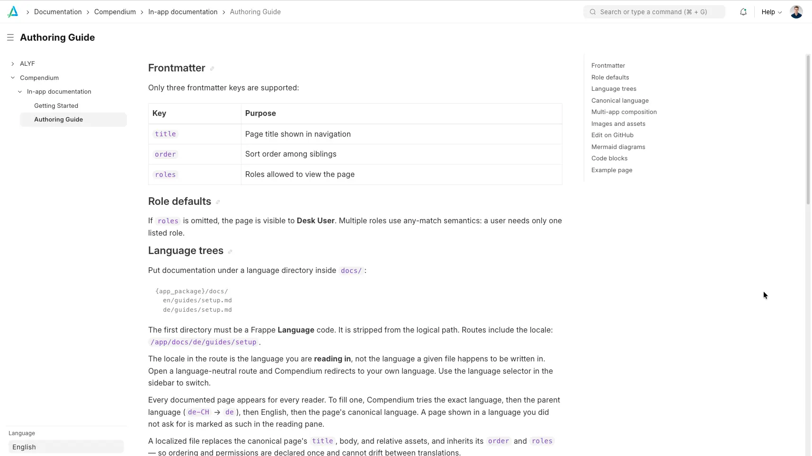

<p align="center">
  
</p>

### Compendium

In-app documentation for Frappe Desk. Compendium aggregates Markdown files from every installed app's `docs/{language}/**/*.md` tree and serves them at `/app/docs`.

<p align="center">
  
</p>

See the [built-in docs](compendium/docs) for authoring conventions and a getting-started guide.

### Features

- Multi-app docs: any installed app can ship Markdown under `docs/{language}/`
- Role-gated pages via frontmatter (`title`, `order`, `roles`)
- Multi-language trees with locale picker and fallback (`de-CH` → `de` → `en`)
- Later apps override the same logical path
- Relative images served safely from each app's `docs/` tree
- Mermaid diagrams in fenced code blocks
- Syntax highlighting for fenced code blocks
- Desk entry points: `/app/docs`, Help menu, and the `/apps` picker

### Installation

You can install this app using the [bench](https://github.com/frappe/bench) CLI:

```bash
cd $PATH_TO_YOUR_BENCH
bench get-app $URL_OF_THIS_REPO --branch version-15
bench --site your-site install-app compendium
```

After install, open `/app/docs` in Desk (or use **Compendium** in the Help menu).

Other apps can ship their own docs by adding a `docs/` folder to their package, for example `my_app/docs/en/guides/setup.md`.

### Contributing

This app uses `pre-commit` for code formatting and linting. Please [install pre-commit](https://pre-commit.com/#installation) and enable it for this repository:

```bash
cd apps/compendium
pre-commit install
```

Pre-commit is configured to use the following tools for checking and formatting your code:

- ruff
- eslint
- prettier
- pyupgrade

### CI

This app can use GitHub Actions for CI. The following workflows are configured:

- CI: Installs this app and runs unit tests on every push to `develop` branch.
- Linters: Runs [Frappe Semgrep Rules](https://github.com/frappe/semgrep-rules) and [pip-audit](https://pypi.org/project/pip-audit/) on every pull request.


### License

mit
