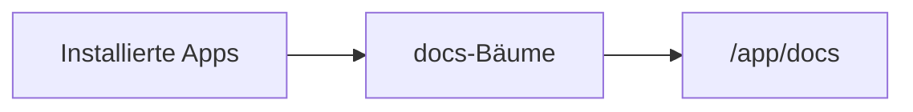

# Leitfaden zum Verfassen


## Frontmatter

Es werden nur drei Frontmatter-Schlüssel unterstützt:

| Schlüssel | Zweck |
| --- | --- |
| `title` | Seitentitel in der Navigation |
| `order` | Sortierung unter gleichrangigen Seiten |
| `roles` | Rollen, die die Seite sehen dürfen |

## Standardrollen

Fehlt `roles`, ist die Seite für **Desk User** sichtbar. Bei mehreren Rollen genügt
eine Übereinstimmung: Ein Benutzer braucht nur eine der aufgeführten Rollen.

## Sprachbäume

Legen Sie Dokumentation in einem Sprachverzeichnis innerhalb von `docs/` ab:

```text
{app_package}/docs/
  en/guides/setup.md
  de/guides/setup.md
```

Das erste Verzeichnis muss ein Frappe-**Language**-Code sein. Es wird aus dem
logischen Pfad entfernt. Routen enthalten die Locale: `/app/docs/de/guides/setup`.

Die Locale in der Route ist die Sprache, in der Sie **lesen** — nicht die Sprache,
in der eine einzelne Datei verfasst ist. Öffnen Sie eine sprachneutrale Route,
leitet Compendium Sie in Ihre eigene Sprache weiter. Zum Wechseln dient die
Sprachauswahl in der Seitenleiste.

Jede dokumentierte Seite erscheint für jeden Leser. Um sie zu füllen, versucht
Compendium die exakte Sprache, dann die übergeordnete Sprache (`de-CH` → `de`),
dann Englisch und zuletzt die kanonische Sprache der Seite. Eine Seite, die in
einer anderen als der angeforderten Sprache erscheint, wird im Lesebereich
entsprechend gekennzeichnet.

Eine übersetzte Datei ersetzt `title`, Text und relative Assets der kanonischen
Seite und erbt deren `order` und `roles` — Sortierung und Berechtigungen werden
also einmal festgelegt und können zwischen Übersetzungen nicht auseinanderlaufen.

## Kanonische Sprache

Die kanonische Seite eines Pfads besitzt dessen `order` und `roles`. Das ist die
englische Seite, wo immer es eine gibt; Apps, die auf Englisch dokumentieren,
müssen deshalb nichts weiter tun.

Eine App ganz ohne englische Dokumentation wird vollständig unterstützt: Ihre
kanonische Sprache ist die eine Sprache, in der sie dokumentiert, und ihre Seiten
erscheinen für Leser jeder Sprache. Dokumentiert eine solche App in mehreren
Sprachen, gewinnt die Sprache mit den meisten Seiten. Um sicherzugehen, legen Sie
sie in `hooks.py` ausdrücklich fest:

```python
docs_canonical_language = "de"
```

## Zusammenspiel mehrerer Apps

Später installierte Apps ersetzen Text und Metadaten einer Seite mit identischem
logischem Pfad. Untergeordnete Pfade werden weiterhin unabhängig zusammengeführt.

Eine Übersetzung greift nur, wenn sie aus der App stammt, der die kanonische Seite
gehört, oder aus einer später installierten App.

## Bilder und Assets

Verweisen Sie im Markdown mit relativen Pfaden auf Bilder. Compendium liefert sie
über `compendium.docs.get_asset` aus, sodass Assets im `docs/`-Baum der jeweiligen
App bleiben.

## Mermaid-Diagramme

`mermaid`-Codeblöcke werden im Lesebereich als Diagramm dargestellt:



Die [Mermaid-Syntaxdokumentation](https://mermaid.ai/open-source/intro/) listet die
verfügbaren Diagrammtypen auf.

## Codeblöcke

Codeblöcke werden im Lesebereich mit Syntaxhervorhebung dargestellt. Geben Sie die
Sprache an, wo es darauf ankommt:

```python
def hello():
	print("Hello")
```

## Beispielseite

```md
---
title: Erste Schritte
order: 1
roles:
  - Desk User
  - System Manager
---

# Erste Schritte

Hier steht Ihr Dokumentationsinhalt.
```
