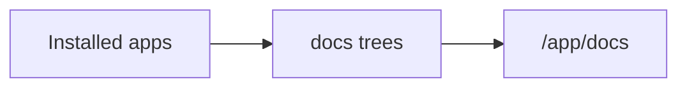

## Frontmatter

Only three frontmatter keys are supported:

| Key | Purpose |
| --- | --- |
| `title` | Page title shown in navigation |
| `order` | Sort order among siblings |
| `roles` | Roles allowed to view the page |

## Role defaults

If `roles` is omitted, the page is visible to **Desk User**. Multiple roles use
any-match semantics: a user needs only one listed role.

## Language trees

Put documentation under a language directory inside `docs/`:

```text
{app_package}/docs/
  en/guides/setup.md
  de/guides/setup.md
```

The first directory must be a Frappe **Language** code. It is stripped from the
logical path. Routes include the locale: `/app/docs/de/guides/setup`.

The locale in the route is the language you are **reading in**, not the language a
given file happens to be written in. Open a language-neutral route and Compendium
redirects to your own language. Use the language selector in the sidebar to switch.

Every documented page appears for every reader. To fill one, Compendium tries the
exact language, then the parent language (`de-CH` → `de`), then English, then the
page's canonical language. A page shown in a language you did not ask for is
marked as such in the reading pane.

A localized file replaces the canonical page's `title`, body, and relative assets,
and inherits its `order` and `roles` — so ordering and permissions are declared
once and cannot drift between translations.

## Canonical language

The canonical page of a path owns its `order` and `roles`. It is the English page
wherever one exists, so apps documenting in English need to do nothing.

An app that ships no English docs at all is fully supported: its canonical
language is the one language it documents in, and its pages appear for readers of
every language. If such an app documents in several languages, the one carrying
the most pages wins; declare it explicitly in `hooks.py` to be sure:

```python
docs_canonical_language = "de"
```

## Multi-app composition

Later installed apps replace the page body and metadata at an identical logical
path. Child paths continue to merge independently.

For translations, a localized variant applies only when it comes from the app
that owns the canonical page or a later installed app.

## Images and assets

Reference images with relative paths in Markdown. Compendium serves them through
`compendium.docs.get_asset`, so assets stay inside the owning app's `docs/` tree.

## Edit on GitHub

When an app declares a GitHub `Repository` URL under `[project.urls]` in its
`pyproject.toml`, contributors with the **Compendium Contributor** role see an
**Edit on GitHub** link that opens the Markdown file for the current page.

```toml
[project.urls]
Repository = "https://github.com/alyf-de/compendium.git"
```

## Mermaid diagrams

Fenced `mermaid` blocks render as diagrams in the reading pane:



See the [Mermaid syntax docs](https://mermaid.ai/open-source/intro/) for diagram types.

## Code blocks

Fenced code blocks get syntax highlighting in the reading pane. Prefer a language
tag when it matters:

```python
def hello():
	print("Hello")
```

## Alerts

GitHub alert syntax turns a blockquote into a callout. The `[!TYPE]` line
becomes an icon and a bold heading. Five types are available:

> [!NOTE]
> Extra information that is useful even when skimming.

> [!TIP]
> Advice that makes a task easier.

> [!IMPORTANT]
> Information the reader needs to reach their goal.

> [!WARNING]
> Urgent information. Act on it to avoid a problem.

> [!CAUTION]
> A risk or a negative outcome of an action.

Write them as a blockquote whose first line is the type marker:

```md
> [!NOTE]
> Extra information that is useful even when skimming.
```

## Example page

```md
---
title: Getting Started
order: 1
roles:
  - Desk User
  - System Manager
---

Your documentation content here.
```
